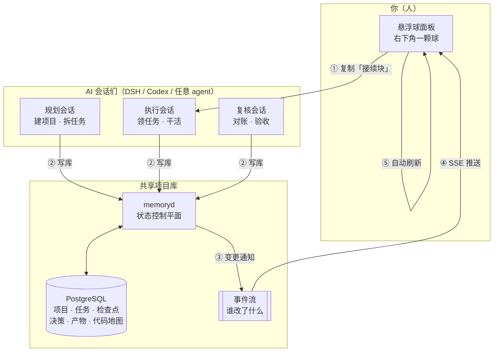
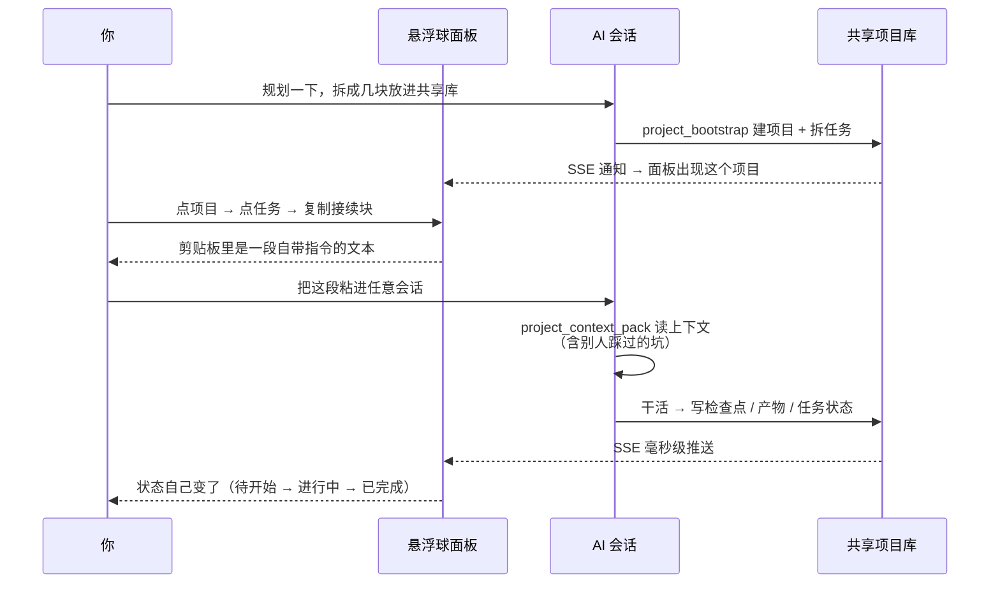
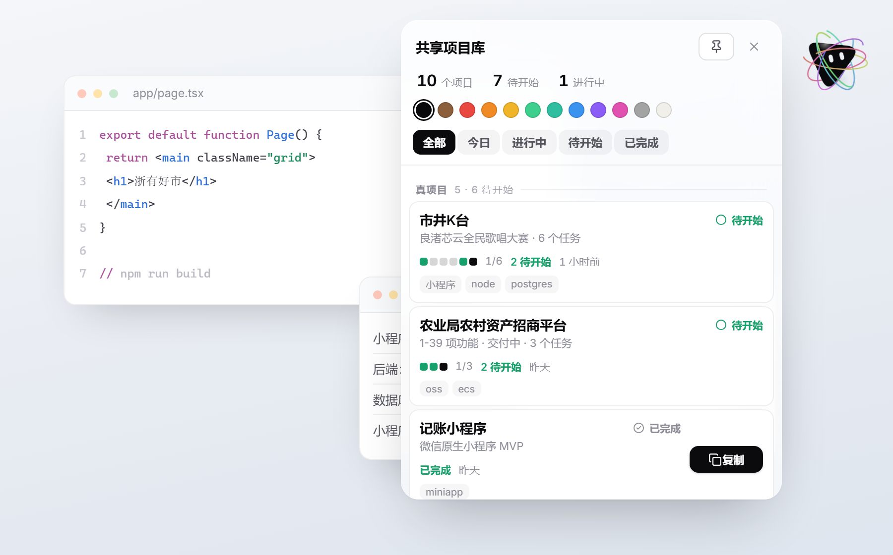
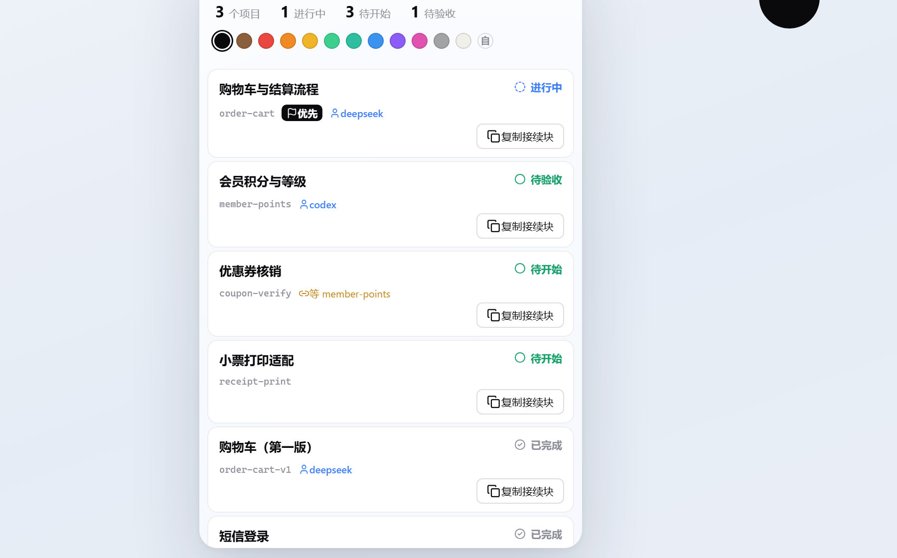

# 共享项目库

> **多个 AI 会话共用一个项目状态库，你用一个悬浮球面板看进度。**
>
> AI 之间怎么交接、踩过什么坑、下一步干什么——那些由库来说；
> 你只需要看到：**这个项目拆成了几个任务、完成了几个。**

---

**English** — A minimal, **read-only** floating-ball panel that shows the progress of projects coordinated by
multiple AI agents. It sits on your desktop as a draggable orb (right-top corner by default), and expands into a
compact card list: *project name · status · done/total · task squares*. Click a task to copy a ready-to-paste
handoff prompt; paste it into any agent (DeepSeek Harness, Codex, …) and the agent picks up the work, writes its
results back to the shared library, and the panel updates itself in real time via SSE.

Built with **Tauri 2 + Rust + TypeScript**, data comes straight from PostgreSQL (read-only), no framework on the
frontend. Requires the [codex-memory](https://github.com/Paeonia-wh/codex-memory) backend.


<p align="center"><sub>开机后桌面上只有一颗球 · 点它才展开</sub></p>

---

## 全景：它是怎么跑起来的



**一句话**：面板只负责**下指令**和**看结果**；所有真活由 AI 干、所有事实由库记。

---

## 两部分各干什么

| | **共享项目库**（后端） | **悬浮球面板**（前端） |
|---|---|---|
| 给谁看 | **AI 之间** | **人** |
| 管什么 | 项目、任务、依赖、租约、合同、检查点、决策、坑、代码地图、审计事件 | 项目名、状态、完成了几个 / 共几个 |
| 怎么用 | AI 通过 MCP 工具读写 | 点球展开、点任务复制一句指令 |
| 不做什么 | 不存聊天记录、不存私有推理 | **不写库**（只读 + 复制文本） |

> **设计原则**：一份事实来源（PostgreSQL），两个消费者——AI 读结构化数据，人看极简进度。
> 面板**绝不**自己发明状态：所有数字都来自库，改了库面板就跟着变。

---

## 一条路走完



**关键**：粘过去的那段文本**自带收尾指令**——AI 干完会自己沉淀回库，不用你再催。

---

## 界面

| 面板展开 | 任务列表 |
|---|---|
|  |  |
| 项目卡：名字 · 状态 · `完成/总数` · 任务格<br/>`⬛` 已完成 `🟦` 在做 `🟩` 待领 | 点进去看每个任务<br/>每张卡可单独复制接续块 |

**只有这些信息**。知识图谱、踩过的坑、决策记录、交接——那些都是**给 AI 读的**，面板不显示。

---

## 快速开始

```bash
# 1) 先跑起共享项目库（另一个仓库）
git clone https://github.com/Paeonia-wh/codex-memory.git
cd codex-memory/repo && ./scripts/start-services.ps1
#    详细步骤见：https://github.com/Paeonia-wh/codex-memory/blob/main/docs/SETUP.md

# 2) 再跑这个面板
git clone https://github.com/Paeonia-wh/shared-lib-panel.git
cd shared-lib-panel
npm install
npm run dev                  # 开发模式（热重载）
npm run build                # 出正式安装包（Tauri bundle）

# 只编译不打包（想直接跑 exe 时用这个，快很多）
cd src-tauri && cargo build --release
# 产物：src-tauri/target/release/shared-lib-panel.exe
```

### 配置（可选，都有默认值）

| 环境变量 | 默认 | 说明 |
|---|---|---|
| `CODEX_MEMORY_HOME` | `D:\codex-memory` | 共享库根目录 |
| `CODEX_MEMORY_PANEL_DSN` | `host=127.0.0.1 port=55440 user=codex_memory dbname=codex_memory` | PostgreSQL 连接 |
| `CODEX_MEMORY_PANEL_DAEMON` | `http://127.0.0.1:47831` | memoryd 地址 |
| `CODEX_MEMORY_PANEL_PYTHON` | `%CODEX_MEMORY_HOME%\runtime\venv\Scripts\python.exe` | 取 token 用 |

---

## 特性

- **悬浮球**：`bloub` 引擎驱动（会眨眼、视线跟着鼠标、可拖动）；开机自启、不占任务栏、空白处鼠标穿透
- **实时**：PostgreSQL 触发器 → memoryd SSE → 面板毫秒级刷新（带指纹比对，数据没变不重绘）
- **任务格**：一个方块 = 一个任务，颜色 = 状态，一眼看出分布
- **接续块**：任务级指令，含 `task_key`，粘给任意 AI 都能精确接上
- **不打扰**：未拆解的项目给「让 AI 拆任务」指令；已完成的安静待着

---

## 技术栈

`Tauri 2` · `Rust` · `TypeScript` · `PostgreSQL` · `SSE`

- 面板：原生 HTML/CSS/TS，esbuild 打包，无框架
- 外壳：Tauri 2（无边框 + 透明 + 工具窗口，内存 ~36MB）
- 数据：Rust 直连 PostgreSQL（只读），实时走 SSE

---

## 致谢

- 悬浮球形象来自 [**bloub**](https://github.com/jeremy-prt/bloub)（MIT）—— x.ai 机器人头像的 SVG 复刻，作者 Jeremy Perret
- 图标来自 [Lucide](https://github.com/lucide-icons/lucide)（MIT）
- 字体 Inter（OFL）

## 许可

[MIT](LICENSE)